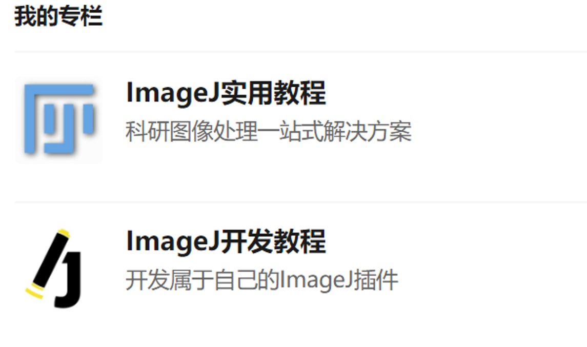

# ImageJ Tutorial

Supplementary for my ImageJ Tutorial: 

[ImageJ实用教程](https://zhuanlan.zhihu.com/c_1069243926476673024)

[ImageJ开发教程](https://zhuanlan.zhihu.com/c_1101076075773370368)

This repository contains:
1. Macro codes(Located in [Develop tutorial](https://github.com/inanezhao/ImageJ-Tutorial/tree/master/Develop%20tutorial) folder)
2. Textbooks
3. Plugins files
4. Sample images

**Any questions, please contact me via email**: zhaoyc9@163.com

Hope you enjoy!

Ethan Zhao

